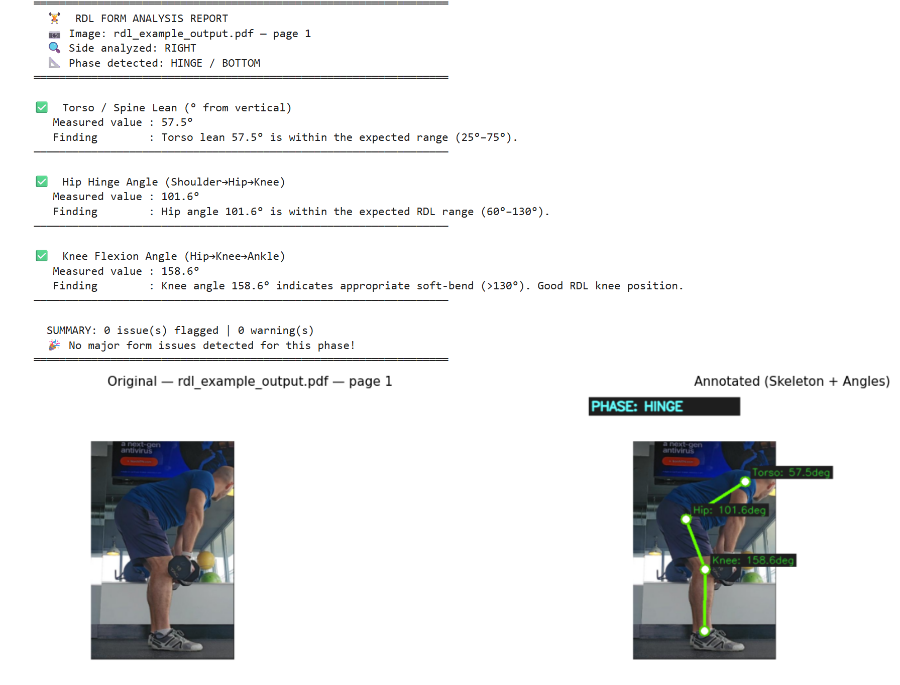

# Computer Vision in Fitness: Evaluating Two-Handed Dumbbell Romanian Deadlift Form

**Team Member:** Michael Bowman  
**Program:** Dumbbell Romanian Deadlift Form Analyzer

## Project Description

This project uses Python and MediaPipe Pose to analyze still images of the two-handed dumbbell Romanian deadlift. The program accepts a PDF containing multiple images or individual image files as input. MediaPipe detects body landmarks and calculates three measurements at the bottom position of the movement:

- Hip angle
- Knee angle
- Torso lean

The measurements are compared with predetermined angle ranges to identify whether each position is within the expected range. The program also creates annotated images and a batch summary table showing the results.

## Example Output

The example below shows the analyzer evaluating the bottom position of a two-handed dumbbell Romanian deadlift. MediaPipe Pose identifies body landmarks and calculates hip angle, knee angle, and torso lean, then compares the measurements with the project's expected ranges.

The sample image was provided by the project author.

## Recommended Environment

Google Colab is the recommended environment for running this project. The notebook includes installation commands and uses the Google Colab file-upload interface to select a PDF or individual image files for analysis.

## Repository Contents

- `RDL_Form_Analyzer.ipynb` – Jupyter notebook containing the complete project workflow and analysis
- `rdl_form_analyzer.py` – Python version of the project code
- `README.md` – Project description and instructions
- `rdl_example_output.png` — Example analysis output displayed in the README
- `.gitignore` – Files excluded from the repository

## Dataset

The original dataset consisted of 17 still images showing the bottom position of the two-handed dumbbell Romanian deadlift. Eleven images were created by the author, and six images were obtained from publicly available online sources for educational analysis.

The original image dataset is not included in this public repository due to privacy and source-image considerations. Users may run the notebook using their own PDF or individual image files. The program uses MediaPipe Pose to identify body landmarks and calculate hip angle, knee angle, and torso lean.

## Angle Ranges

The program compares each image’s measurements with the following predetermined ranges:

- **Hip angle:** 60°–130°
- **Knee angle:** at least 130°
- **Torso lean:** 25°–75° from vertical

An image is considered within the expected range only when all three measurements meet these criteria. The ranges were selected based on biomechanics and exercise-form guidance reviewed during the project.

## How to Run the Project

### Google Colab

1. Download or clone this GitHub repository.
2. Open `RDL_Form_Analyzer.ipynb` in Google Colab.
3. Run the notebook cells in order.
4. When the file-selection window appears, upload a PDF containing exercise images or select compatible individual image files.
5. The program will convert PDF pages to images when applicable and analyze each image individually.
6. Review the annotated images, angle measurements, and batch summary generated by the notebook.

## Dependencies

- Python
- MediaPipe
- OpenCV
- NumPy
- Matplotlib
- Pandas
- pdf2image
- Poppler utilities
 
